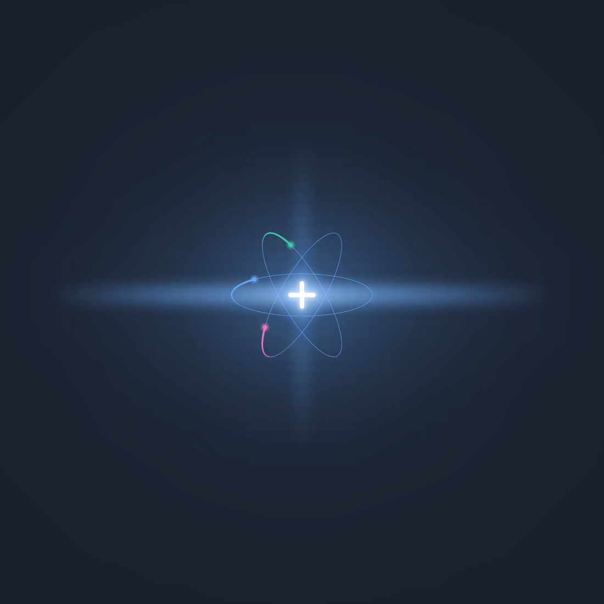

<div style="overflow:hidden; width:100%; display:block;">
  
</div>

<br>

# ERB Custom - Advanced Desktop Application Framework

<p>
  A comprehensive desktop application framework built on <a href="https://electron.atom.io/">Electron</a>, <a href="https://facebook.github.io/react/">React</a>, and <a href="https://www.typescriptlang.org/">TypeScript</a>, enhanced with powerful modules for media streaming, file management, P2P networking, game development, and stunning UI components.
</p>

## ✨ Features Overview

### 🎮 Game Development

- **Phaser 3 Integration** - Full-featured HTML5 game engine with WebGL and Canvas rendering
  - Arcade physics engine
  - Asset management and preloading
  - Scene management system
  - React wrapper component for seamless integration
  - [Documentation](docs/PHASER_INTEGRATION.md)

### 📁 File System & Media

- **Advanced File Operations** - Enterprise-grade file management
  - Native file/folder dialogs with filters
  - Memory-efficient text file reading with size limits
  - Binary file operations with safeguards
  - File caching with progress tracking
  - Cross-platform file metadata access
  - Async/await IPC handlers

- **Custom Stream Protocol** - `filestream://` protocol for direct file streaming
  - HTTP range request support for media seeking
  - UNC path handling for network drives
  - Automatic MIME type detection
  - Optimized for video/audio playback

- **System Paths Helper** - Cross-platform system folder access
  - Documents, Desktop, Downloads, Pictures, Videos, Music
  - Environment variable override support
  - Legacy folder detection for migrations

### 🌐 Networking & Collaboration

- **LAN Share Module** - Peer-to-peer file transfer system
  - UDP broadcast-based peer discovery
  - HTTP server for file transfers
  - Project/folder sharing with ZIP compression
  - Offer/accept workflow for secure transfers
  - Display name resolution (Windows/Mac/Linux)
  - Real-time transfer progress tracking
  - Designed for trusted network environments
  - [Security documentation](docs/LAN_SHARE_SECURITY.md)

### � UI/UX Components

- **Multiple UI Framework Support**
  - **Material-UI (MUI)** - Google Material Design components
  - **Chakra UI** - Modern, accessible component library
  - **Bootstrap** - Classic responsive framework
  - **Framer Motion** - Production-ready animations
  - **GSAP** - Professional-grade animation engine

- **React Three Fiber (R3F)** - 3D graphics and WebGL
  - Three.js integration for React
  - @react-three/drei helper components
  - @react-three/postprocessing effects
  - @react-three/rapier physics engine
  - OGL lightweight WebGL library

- **React Bits Collection** - 60+ Premium UI Components
  - **Animations** (25+ components): BlobCursor, ClickSpark, ElectricBorder, GlareHover, ImageTrail, LaserFlow, MagnetLines, MetaBalls, PixelTrail, Ribbons, SplashCursor, StarBorder, and more
  - **Backgrounds**: Aurora, dynamic gradients, animated patterns
  - **Components** (36+ components): AnimatedList, BounceCards, Carousel, ChromaGrid, CircularGallery, Dock, DomeGallery, FluidGlass, GlassIcons, InfiniteScroll, MagicBento, Masonry, ModelViewer, ProfileCard, SpotlightCard, and more
  - **Text Animations**: Typewriter effects, gradient text, animated headings
  - All components use TS-CSS variant (no Tailwind required)
  - Install script for bulk component setup

### 🔧 Developer Experience

- **Hot Module Replacement (HMR)** - Instant feedback during development
- **TypeScript** - Full type safety across main and renderer processes
- **React Router v7** - Client-side routing
- **Module Status Component** - Visual indicators for module availability
- **Comprehensive Error Handling** - Graceful degradation and user feedback
- **Multiple Build Targets** - NSIS installer, one-click installer, portable builds

## 📦 What's Included

### Core Technologies

- **Electron 35** - Latest Electron with security updates
- **React 19** - Latest React with concurrent features
- **TypeScript** - Full type coverage
- **Webpack 5** - Advanced bundling and optimization
- **React Fast Refresh** - Instant component updates

### Graphics & Animation Libraries

- **GSAP 3.13** - Industry-standard animation
- **Three.js** - 3D graphics library
- **Phaser 3.87** - Game development framework
- **Framer Motion** - React animation library
- **Lenis** - Smooth scroll library
- **Matter.js** - 2D physics engine

### Utilities

- **Archiver & Extract-Zip** - Archive creation and extraction
- **React Icons** - 10,000+ icon library
- **Electron Debug** - Development tools
- **Electron Updater** - Auto-update functionality

See [INTEGRATION_COMPLETE.md](designDocs/INTEGRATION_COMPLETE.md) for detailed integration documentation.

<br>

## 🚀 Getting Started

### Installation

Clone the repository and install dependencies:

```bash
git clone https://github.com/tcgm/erb-custom.git
cd erb-custom
npm install
```

### Starting Development

Launch the app in development mode with hot reload:

```bash
npm start
```

The app will open with all modules initialized. Check the Module Status component to verify that all features are available.

### Installing React Bits Components

To install all React Bits components with their dependencies:

```bash
npm run react-bits:install-all
```

Or install just the animation dependencies:

```bash
npm run react-bits:deps
```

### Project Structure

```
erb-custom/
├── src/
│   ├── main/                    # Electron main process
│   │   ├── main.ts              # Application entry point
│   │   ├── preload.ts           # Preload script (IPC bridge)
│   │   ├── menu.ts              # Application menu
│   │   ├── helpers/             # Helper utilities
│   │   │   └── systemPaths.ts   # Cross-platform system paths
│   │   └── modules/             # Feature modules
│   │       ├── fileOperations.ts      # File system operations
│   │       ├── lanShare.ts            # P2P file sharing
│   │       └── customStreamProtocol.ts # Media streaming
│   │
│   └── renderer/                # React application
│       ├── App.tsx              # Root component
│       ├── MainComponent.tsx    # Main UI component
│       ├── components/          # React components
│       │   ├── react-bits/      # 60+ premium UI components
│       │   ├── ModuleStatus.tsx # Module availability indicator
│       │   └── AnimatedLogo.tsx # Animated branding
│       ├── phaser/              # Phaser game engine integration
│       │   ├── PhaserGame.tsx   # React wrapper
│       │   └── scenes/          # Game scenes
│       └── assets/              # Static assets
│           ├── fonts/
│           ├── icons/
│           ├── images/
│           └── textures/
│
├── docs/                        # Documentation
│   ├── PHASER_INTEGRATION.md   # Phaser setup guide
│   └── LAN_SHARE_SECURITY.md   # LAN Share security
│
├── designDocs/                  # Design documentation
│   ├── INTEGRATION_COMPLETE.md # Integration details
│   └── PHASER_ADDED.md         # Phaser implementation
│
└── release/                     # Build output
    └── app/                     # Packaged application
```

## 📦 Building for Production

### Build All Installers

Build NSIS, one-click, and portable versions:

```bash
npm run build:all
```

Or use shortcuts:

```bash
npm run pack
npm run package
npm run build
```

### Individual Build Targets

```bash
npm run build:nsis       # NSIS installer with custom options
npm run build:oneclick   # One-click installer
npm run build:portable   # Portable executable
```

### Build Configuration

Build configurations are in:

- `electron-builder.base.json` - Base configuration
- `electron-builder.nsis.json` - NSIS installer settings
- `electron-builder.oneclick.json` - One-click installer settings
- `electron-builder.portable.json` - Portable build settings

## 🎯 Usage Examples

### Using File Operations

```typescript
// In your renderer component
const handleOpenFile = async () => {
  const filePath = await window.electron.fileOperations.openFile({
    filters: [
      { name: 'Images', extensions: ['jpg', 'png', 'gif'] },
      { name: 'All Files', extensions: ['*'] }
    ]
  });
  
  if (filePath) {
    const content = await window.electron.fileOperations.readText(filePath);
    console.log(content);
  }
};
```

### Using LAN Share

```typescript
// Start peer discovery
await window.electron.lanShare.scanStart();

// Share a folder
await window.electron.lanShare.share({
  path: '/path/to/folder',
  projectName: 'MyProject'
});

// Listen for incoming file offers
window.electron.lanShare.onOffer((offer) => {
  console.log(`Received offer: ${offer.projectName}`);
});
```

### Using Custom Stream Protocol

```typescript
// In your renderer, load media files directly
<video src="filestream:///C:/Videos/movie.mp4" controls />
<audio src="filestream:///home/user/music/song.mp3" controls />
```

### Using Phaser

```typescript
import PhaserGame from './phaser/PhaserGame';
import MyGameScene from './phaser/scenes/MyGameScene';

function App() {
  return (
    <PhaserGame 
      width={800} 
      height={600} 
      scenes={[MyGameScene]} 
    />
  );
}
```

### Using React Bits Components

```typescript
import Dock from './components/react-bits/all/Components/Dock/Dock';
import BlobCursor from './components/react-bits/all/Animations/BlobCursor/BlobCursor';
import Aurora from './components/react-bits/all/Backgrounds/Aurora/Aurora';

function App() {
  return (
    <>
      <BlobCursor />
      <Aurora />
      <Dock items={dockItems} />
    </>
  );
}
```

## 🔒 Security Considerations

### LAN Share Module

The LAN Share module is designed for **trusted networks only** (home/office LANs). For detailed security information and optional hardening strategies, see:

- [LAN Share Security Documentation](docs/LAN_SHARE_SECURITY.md)

Key security features:

- Offer/accept workflow prevents unsolicited transfers
- No authentication required (trusted network assumption)
- Optional firewall configuration
- Transfer logging for audit trails

### File Operations

File operations include built-in safeguards:

- Size limits on text file reading (default 50MB)
- Path validation to prevent directory traversal
- Error handling for permission issues
- Async operations to prevent UI blocking

## 🛠️ Development Scripts

```bash
npm start              # Start development server
npm run lint           # Run ESLint
npm run lint:fix       # Fix ESLint errors
npm test               # Run tests
npm run build:dll      # Build development DLLs
npm run build:main     # Build main process (production)
npm run build:renderer # Build renderer process (production)
```

## 📚 Documentation

- [Phaser Integration Guide](docs/PHASER_INTEGRATION.md)
- [LAN Share Security](docs/LAN_SHARE_SECURITY.md)
- [Integration Details](designDocs/INTEGRATION_COMPLETE.md)
- [React Bits README](src/renderer/components/react-bits/README.md)

## 🤝 Contributing

This is a customized fork of [Electron React Boilerplate](https://github.com/electron-react-boilerplate/electron-react-boilerplate) with additional features for TCGM projects.

## � License

MIT © [TCGM](https://thecrazygamemaster.com)

## 🙏 Acknowledgments

Based on [Electron React Boilerplate](https://github.com/electron-react-boilerplate/electron-react-boilerplate)

Special thanks to:

- The Electron React Boilerplate team
- All open-source library maintainers
- The React and Electron communities

---

<div align="center">

**[Homepage](https://github.com/tcgm/erb-custom)** •
**[Issues](https://github.com/tcgm/erb-custom/issues)** •
**[TCGM](https://thecrazygamemaster.com)**

</div>
